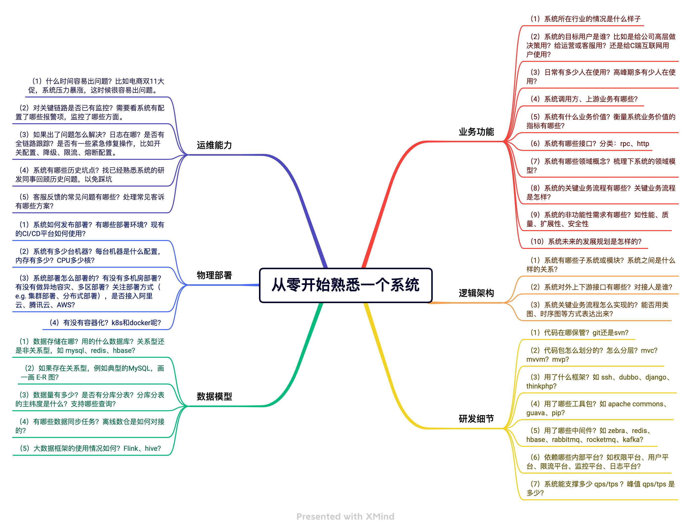

# 0x0 新人的痛点

> 我在校招的时候，通过刷题和八股文的策略拿到了满意的offer，但是缺乏企业级项目的实战，在第一份工作的试用期的时候，吃了很多苦头。牛客上关于面试的帖子太多了，大部分帖子关注的是如何进入大厂，如何在校招中收割offer，以及各种公众号自媒体的引流，很少有人分享如何在试用期内平稳落地，这块明显是应届生的短板，所以今天简单分享下个人经验。

后端程序员经常会面临下面的场景：

① 校招/社招新人入职，需要学习已有系统，作为工作 landing 的核心部分；

② 同事离职或转岗，需要把系统交接给你，面对完全陌生的系统，如何快速参与开发和bug fix；

③ 经典面试问题？介绍下你的项目，如何给完全不懂的面试官解释自己的项目是干嘛的。

上述的场景都可以被解释为通用的问题：如何从零开始熟悉系统，我们是否能从中抽象出通用的梳理框架？我不推荐一上来就看代码的方式，方法太粗暴并且视野狭隘。下面手把手教大家从业务、逻辑、物理等不同的纬度把握一个系统的脉络，框架是系统的主干，剩下的细节则是具体的代码。

# 0x1 业务功能

所谓业务功能的学习就是从业务角度去学习系统，我们需要了解系统的客户是谁、使用人是谁、带来了什么价值，系统提供了哪些功能等。如果不清楚业务，就等于不知道系统在干什么。

技术不是空中楼阁，我们写的代码都是为了服务某个主体存在，最终目的是业务落地，清楚了业务才知道怎样用技术更好地服务业务，所以业务学习是熟悉一个系统的首要任务。

这块主要的学习方式：

① 沟通：和产品、运营、开发、测试沟通，遇事不决多私聊。

② 实践：自己使用系统，比如你是淘宝下单页的开发，你肯定要自己先尝试下单和支付的整套流程。

③ 文档：尝试从内部平台找到一些常见业务图，如产品功能架构图、业务流程图、功能树，用例图等，学习产品设计文档，找找PRD。

尝试给自己提出下面的问题并且找到答案：

- 系统所在行业的情况是什么样子？

  e.g. 如果是支付系统，目前国内是什么情况，alipay和wechat有啥区别？
- 系统的目标用户是谁？比如是给公司高层做决策用？给运营或客服用？还是给C端互联网用户使用？ 

  e.g. 这是toC还是toB或者内部平台系统，系统做出来会给谁带来使用价值？
- 日常有多少人在使用？高峰期多有少人在使用？

  e.g. 日常的流量是否存在维护风险？如果是电商系统，双十二大促流量是多少?
- 系统调用方：应用名 

  e.g. 可以通过公司的调用监控平台查看，上游业务方有哪些？
- 系统有什么业务价值？衡量系统业务价值的指标有哪些？

  e.g. 例如对于cmdb系统，系统的业务价值在于提供功能完善的运维平台，已经接入的物理机器数量，逻辑业务数量等。
- 系统有哪些接口？分类：rpc、http
  
    e.g. rpc接口和http接口有啥区别，什么时候应该提供http接口，什么时候应该提供rpc接口。
    
- 系统有哪些领域概念？梳理下系统的领域模型？
  
    e.g. 设计钱包，钱包的模型有哪些？银行卡是否属于核心领域模型
    
- 系统的关键业务流程有哪些？关键业务流程是怎样？
  
    e.g. 例如朋友圈功能，发布、点赞和评论肯定是核心业务流程
    
- 系统的非功能性需求有哪些？如性能、质量、扩展性、安全性等。
  
    e.g. 老板关注的重点是什么，是系统的稳定性吗，还是系统的用户增长数量
    
- 系统未来的发展规划是怎样的？

       e.g. 未来应该做成什么样子，理由和计划，是否存在重构任务，重构是为了解决什么问题

# 0x2 **逻辑架构&研发细节**

逻辑架构着重考虑功能需求，系统应当向用户提供什么样的服务，关注点主要是行为或职责的划分。常用表达图形，静态图有包图、类图、对象图，动态图有序列图、状态图、活动图。

这块的学习任务是：

① 明确模块划分、接口定义、细分领域模型；

② 着重考虑运行期质量属性，关注点是系统的并发、同步、通信等问题，这势必涉及到进程、线程、对象等运行时概念，以及相关的并发、同步、通信等；

③ 关注系统源代码、第三方 SDK 、使用的框架、中间件、工具包。

尝试给自己提出下面的问题并且找到答案：

- 系统有哪些子系统或模块？系统之间是什么样的关系？
- 系统对外上下游接口有哪些？对接人是谁？
- 系统关键业务流程怎么实现的？能否用类图、时序图等方式表达出来？
- 代码在哪保管？git还是svn？
- 代码包怎么划分的？怎么分层？mvc？mvvm？mvp？
- 用了什么框架？如 ssh、dubbo、django、thinkphp？
- 用了哪些工具包？如 apache commons、guava、pip？
- 用了哪些中间件？如 zebra、redis、hbase、rabbitmq、rocketmq、kafka？
- 依赖哪些内部平台？如权限平台、用户平台、限流平台、监控平台、日志平台？
- 系统能支撑多少 qps/tps ？峰值 qps/tps 是多少？
- 与上下游系统怎么交互的？rpc？http？同步交互还是异步交互？

# 0x3 **物理部署**

物理部署这块主要关注如何保证系统的鲁棒性、性能以及发版和日常运行的安全管理。

这块的学习任务是：

① 明确服务的支撑性能上下限；

② 熟悉开发和发版部署流程，以及内部规范。

尝试给自己提出下面的问题并且找到答案：

- 系统如何发布部署？有哪些部署环境？现有的CI/CD平台如何使用？
- 系统有多少台机器？每台机器是什么配置，内存有多少？CPU多少核？
- 系统部署怎么部署的？有没有多机房部署？有没有做异地容灾、多区部署？关注部署方式（e.g. 集群部署、分布式部署），是否接入阿里云、腾讯云、AWS？
- 有没有容器化？k8s和docker呢？

# 0x4 数据模型

这块主要关注底层数据的模型，不仅仅要关注实体本身，更要关注实体间的数据流动，例如主从同步策略，数据迁移策略，以及不同数据模型的转换。

尝试给自己提出下面的问题并且找到答案：

- 数据存储在哪？用的什么数据库？关系型还是非关系型，如 mysql、redis、hbase？
- 如果存在关系型，例如典型的MySQL，画一画 E-R 图？
- 数据量有多少？是否有分库分表？分库分表的主纬度是什么？支持哪些查询？
- 有哪些数据同步任务？离线数仓是如何对接的？
- 大数据框架的使用情况如何？Flink、hive？

# 0x5 运维能力

系统运维重点关注：

① 如何避免出问题？测试用例维护 & 自动化测试，资源监控 & 流量监控。

② 什么时候会出问题，出了问题怎么解决？历史故障有哪些？是否存在复盘文档？

尝试给自己提出下面的问题并且找到答案：

- 什么时间容易出问题？比如电商双11大促，系统压力暴涨，这时候很容易出问题。
- 对关键链路是否已有监控？需要看系统有配置了哪些报警项，监控了哪些方面。
- 如果出了问题怎么解决？日志在哪？是否有全链路跟踪？是否有一些紧急修复操作，比如开关配置、降级、限流、熔断配置。
- 系统有哪些历史坑点？找已经熟悉系统的研发同事回顾历史问题，以免踩坑。通过同事总结的 case 以及文档，或者与负责的产品、运营、技术与了解。系统总会有一些坑，需要把这些坑填上，填坑的过程就是熟悉系统的过程。历史代码经过多次迭代总会导致复杂度高（分支、嵌套、循环很多），耦合严重，设计漏洞，性能隐患等，很难维护，这些就需要我们去重构了。
- 客服反馈的常见问题有哪些？处理常见客诉有哪些方案？

# 0x6 总结

熟悉了系统的业务和技术后，就要实战了，通过实战进一步加深对系统的熟悉程度。这点不用额外操心，一般leader/mentor都会给新人布置需求，从小规模的修改到大范围的需求支撑。

所谓**操千曲而后晓声，观千剑而后识器**，通过实践上述流程，并且在学习过程中多提问和思考，具体到某个模块为什么要这样设计，目前的代码有什么可以改进的点，目前的中间件是否完美符合业务的应用场景，是否有更好的中间件可以代替，个人对项目的把握会越来越强，通过试用期是理所当然的事情。

