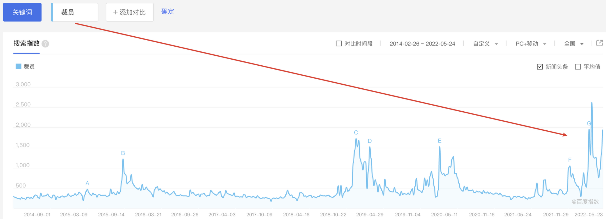
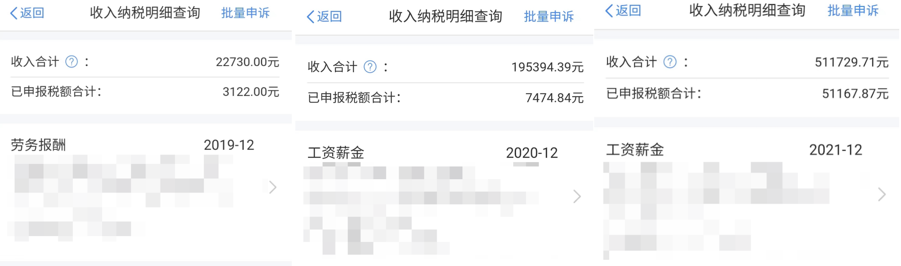
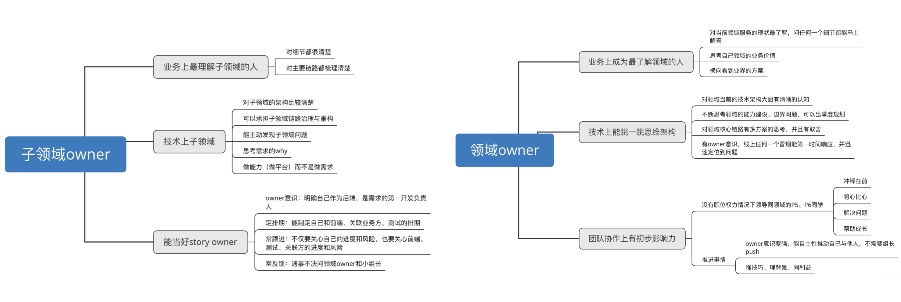

> 距离20年本科毕业接近两年了，本篇是关于过去一年搬砖经历的思考和总结，并且对后续工作的规划。文章准备保持每年更新一次的节奏，第一年归档：[https://github.com/mio4/Java-Gold/blob/master/010-social/one-year.md](https://github.com/mio4/Java-Gold/blob/master/010-social/one-year.md)

## 0x0 职场

关于工作，2020年冬到2021年夏，我经历了职业生涯的第一轮PUA，最终以leader被撤职结束。这里以L代称前leader，L不管对待新人还是老同事，都没有耐心，任何小的错误，在他那里都能被无限放大，有很长一段时间我都处在「上班是一种折磨」的阴影中，长期处于失眠和高压状态。

这样的状态持续了半年多，最后部门老大发现我们小组所有人的进度都比隔壁小组慢，发现是L管理上出了严重问题，因为L对待组员的态度恶劣，其他组员们都会主动避免和L同步进度和项目问题。所以就把L撤职了，从带人的P7降级为只做需求不带人的P7，后来L慢慢被边缘化了，就自己转组走了。

在换了一个leader之后，我的绩效直接从团队倒数10%涨到了前30%，连带着涨薪，不过在新领导对我期望最高的时候，我因为职业发展的诉求选择了离职。

 在职场中跟一个好的领导非常重要，水平不好的领导能把整个团队带散。L是我见过管理能力最差的人，但是从反面也论证了一个失败的leader具备哪些特性，避免自己成长为这样的人：

① 无效会议：小组总共4个人，日会天天开，每次长达一小时或以上，期间无效内容居多；

② 缺乏共情：虽然个人能力不出众，但是对待同事的态度非常恶劣，缺乏有效沟通，能力配不上傲慢。

回头看毕业第一份工作，经历了很多，在10级台风天打不到车全身湿透着上班，在凌晨2点的夜晚加班coding，经历过周末一个人在医院做手术。经历了诸多毒打，这个过程让我更加坚强，从幼稚的学生思维转换为真正意义的社会人心态。

## 0x1 收入

首先是对于大趋势的主观判断，我认为互联网和房地产的增长都遇到了瓶颈，未来很难出现2010-2020这种程度的红利增长，周围大厂「毕业」的人确实太多了，傻地主也开始不养闲人了，越来越多的人认为互联网不是体面活，而是体力活。持有的易方达中概互联50ETF今年亏了六位数， 阿里、美团、拼多多这些公司的股价腰斩再腰斩，但是作为普通人，很难判断是因为增长到头的价值毁灭，还是美联储加息以及政策打压砸出的黄金坑。

其次是互联网逐渐倾向于金融化，对学历和个人能力的要求水涨船高，大厂应届生总包也年年创新高，倒挂成为正常现象，我是20年7月本科毕业的，整理了下2019~2021年的收入：

2019年全年都是实习，2020年下半年有了正式工作，2021年全年都是正式薪资，因为当年绩效垫底，低于预期。幸运的是，对比2021年，2022年是工资收入爆炸性增长的一年，远超预期。

目前还是推荐学历好并且希望依靠自己努力在一二线城市扎根的工科生，转行到互联网或者IC，只论收入而言，互联网的下限还是比天坑专业的上限高，正如李斯的「仓中鼠」理论，都是🐭🐭，居于仓则富，居于厕则窘。

关于副业，因为周围有通过程序员通过讲课获取被动收入的案例，所以我也关注了这个副业渠道，在主动联系了几家在线教育平台后，对这个领域有了初步的了解，例如视频课分为买断制和提成制，买断制是指平台按照时薪一次性结清费用，常见的例如每小时2000元；提成制则是没有保底薪资，平台和讲师按照百分比分成，例如一门课按照100元单价售出，每卖出一门课，讲师拿到诸如50元的报酬。

因为工作上班时间很长，所以采用了写稿的形式，把准备秋招的笔记整理了下，顺利交接：[http://www.imooc.com/wiki/javatextlesson](http://www.imooc.com/wiki/javatextlesson)，这次经历虽然稿费不多，但对于赚钱有了一些新的认知：

① 主动：有很多机会需要自己主动去关注，因为好的资源通常不会主动找上你。

② 人脉：认识从事不同行业的人很重要，领域交叉后往往能制造惊喜。

## 0x2 成长

亚当·斯密在《国富论》的开篇花了三章的篇幅讨论分工，分工是高度发达社会的产物，在农业社会，农民以家作为单位劳动，自己播种、灌溉、收获和加工，忙碌但是效率低下。进入工业社会后，工厂以流水线的形式价值创造，社会的整体效率提高，同时为个体节约时间。

工业的目的是为了讲人从繁杂的劳动中解放出来，但是目前的互联网却事与愿违，巨头们为了扩张和垄断，给予底层码农的就是大小周和996以及重复劳动。《国富论》认为人的天赋差异并不大，分工造成了人的差异，例如哲学家和工人的区别，就是工人将大部分的时间消耗在重复的劳动上，他们的智力不能在流水线上得到锻炼，所以变成了最愚钝的人，同时单调且持久的工作摧毁了他们身体上的活力，也失去了对现实的感知。

所以我在工作的时候，会刻意避免执行重复的任务，这也是程序员最擅长的事情，例如能脚本处理的任务就不用人工，对于工作的内容也是尽力抽象出能够机械执行的方法论，例如 [https://github.com/mio4/Java-Gold/blob/master/010-social/learn-system.md](https://github.com/mio4/Java-Gold/blob/master/010-social/learn-system.md) ，我希望每天都能从工作中学到东西，花的每一小时都能凝聚为个人的能力。

未来的两年我会争取从硬编码能力和软技能上获取成长，从能力模型上看，「子领域owner」大概是P5的要求，「领域owner」大概是P6的要求，大部分人工作的前五年都是围绕着这些目标转圈。

关于业余生活，办了健身卡，每周坚持游泳一次，现在因为疫情暂停了。

我认为编程和英语是程序员的核心竞争力，所以花了3w大洋报了口语班，每周强迫自己学习英语，用了半年的时间摆脱了哑巴英语，现在见到老外能够自信的沟通，这个过程给我最大的收获是「Done is better than perfect」，如果一件事让我觉得很难做，这种抗拒的心理很容易引起拖延症，最后大概率就放弃了，最好的解决办法是先上手开始做，将大项目拆分为小task，积少成多。