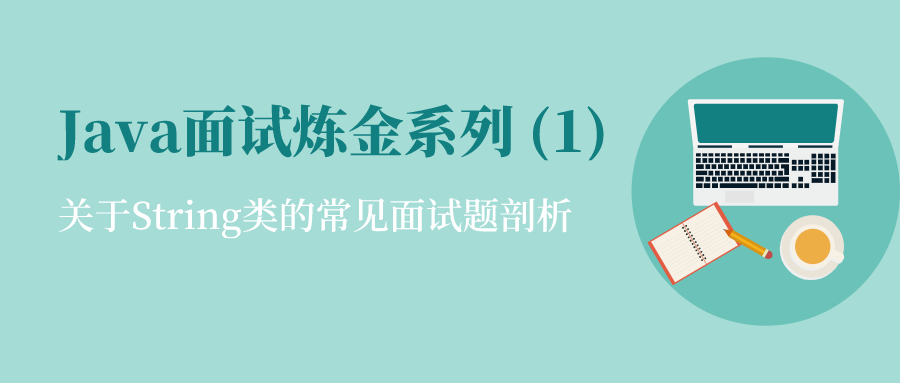
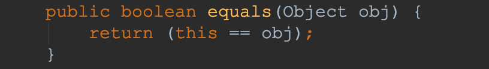
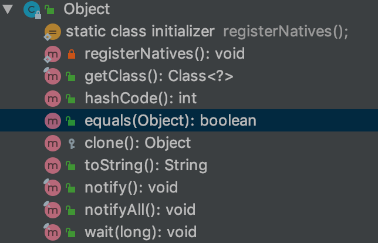
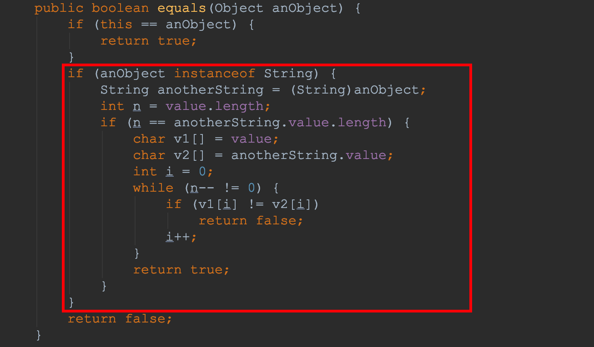
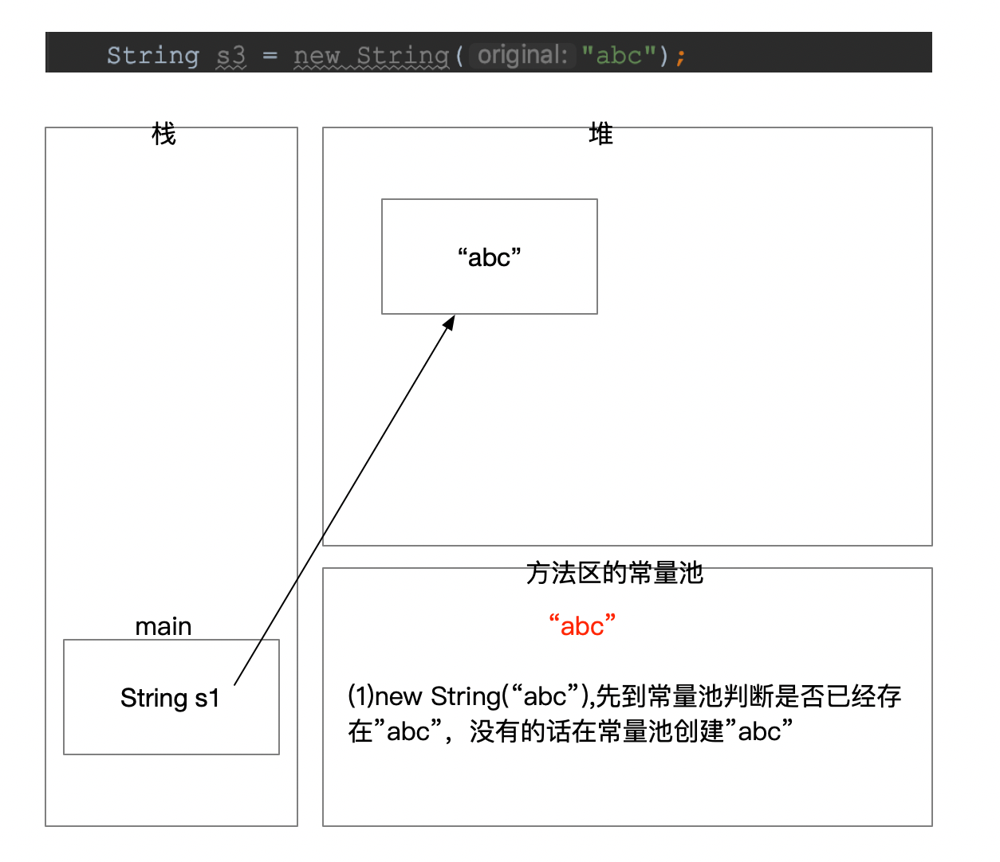
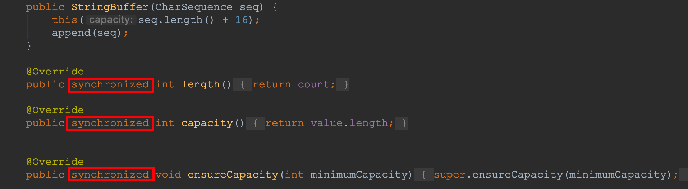

# Java面试炼金系列 (1)  | 关于String类的常见面试题剖析



> 文章以及源代码已被收录到：https://github.com/mio4/Java-Gold


# 0x0 基础知识

## 1. '==' 运算符

Java中的数据类型分为基本数据类型和引用数据类型：

1. 基本类型：编程语言中内置的最小粒度的数据类型。它包括四大类八种类型
   - 4种整数类型：`byte`、`short`、`int`、`long`
   - 2种浮点数类型：`float`、`double`
   - 1种字符类型：`char`
   - 1种布尔类型：`boolean`
2. 引用类型：引用也叫句柄，引用类型，是编程语言中定义的在句柄中存放着实际内容所在地址的地址值的一种数据形式，例如：
   - 类
   - 接口
   - 数组

- 对于基本类型来说，`==` 比较的是它们的值
- 对于引用类型来说，`==` 比较的是它们在内存中存放的地址（堆内存地址）

举例说明：

```java
    public static void main(String[] args) {
        //基本数据类型
        int num1 = 100;
        int num2 = 100;
        System.out.println("num1 == num2 : " + (num1 == num2) + "\n");

        //引用类型，其中'System.identityHashCode'可以理解为打印对象地址
        String str1 = "mio4";
        String str2 = "mio4";
        System.out.println("str1 address : " + System.identityHashCode(str1));
        System.out.println("str2 address : " + System.identityHashCode(str1));
        System.out.println("str1 == str2 : " + (str1 == str2) + "\n");

        String str3 = new String("mio4");
        String str4 = new String("mio4");
        System.out.println("str3 address : " + System.identityHashCode(str3));
        System.out.println("str4 address : " + System.identityHashCode(str4));
        System.out.println("str3 == str4 : " + (str3 == str4));
    }
```

运行上面的代码，可以得到以下结果：

```shell
num1 == num2 : true

str1 address : 1639705018
str2 address : 1639705018
str1 == str2 : true

str3 address : 1627674070
str4 address : 1360875712
str3 == str4 : false
```

可以看到str1和str2的内存地址都是`1639705018`,所以使用`==`判断为`true`,

但是str3和str4的地址是不同的，所以判断为`false`。


## 2. equals()方法

### 2.1 Object类equals()

在Java语言中，所有类都是继承于`Object`这个超类的，在这个类中也有一个`equals()`方法，那么我们先来看一下这个方法。



​	

可以看得出，这个方法很简单，就是比较对象的内存地址的。所以在对象没有重写这个方法时，默认使用此方法，即比较对象的内存地址值。但是类似于String、Integer等类均已重写了`equals()`。下面以`String`为例。

### 2.2 String类equals()



很明显，String的equals()方法仅仅是对比它的 **数据值**，而不是对象的 **内存地址** 。

以 `String` 为例测试一下：

```java
public static void main(String[] args) {
        String str1 = "mio4";
        String str2 = "mio4";

        String str3 = new String("mio4");
        String str4 = new String("mio4");

        System.out.println("str1 address : " + System.identityHashCode(str1));
        System.out.println("str2 address : " + System.identityHashCode(str1));
        System.out.println("str1.equals(str2) : " + str1.equals(str2) + "\n");

        System.out.println("str3 address : " + System.identityHashCode(str3));
        System.out.println("str4 address : " + System.identityHashCode(str4));
        System.out.println("str3.equals(str4) : " + str3.equals(str4) + "\n");
    }
```

测试输出为如下，可以看出`str3`和`str4`地址不同，但是因为String字符串内容相同，所以equals判断为true

```shell
str1 address : 1639705018
str2 address : 1639705018
str1.equals(str2) : true

str3 address : 1627674070
str4 address : 1360875712
str3.equals(str4) : true
```


## 3. hashCode()方法

### 3.1 为啥有这个方法？使用场景

Java中的集合（Collection）有三类，一类是List，一类是Queue，集合内的元素是有序的，元素可以重复；再有一类就是Set，一个集合内的元素无序，但元素不可重复。

- 那么, 这里就有一个比较严重的问题：要想保证元素不重复，可两个元素是否重复应该依据什么来判断呢？ 这就是 **Object.equals** 方法了。但是，如果每增加一个元素就检查一次，那么当元素很多时，后添加到集合中的元素比较的次数就非常多了。 也就是说，如果集合中现在已经有1000个元素，那么第1001个元素加入集合时，它就要调用1000次equals方法。这显然会大大降低效率。于是，Java采用了**哈希表的原理**。 这样，我们对每个要存入集合的元素使用哈希算法算出一个值，然后根据该值计算出元素应该在数组的位置。所以，当集合要添加新的元素时，可分为两个步骤：　　　
  - **先调用这个元素的 hashCode 方法，然后根据所得到的值计算出元素应该在数组的位置。如果这个位置上没有元素，那么直接将它存储在这个位置上；**
  - **如果这个位置上已经有元素了，那么调用它的equals方法与新元素进行比较：相同的话就不存了，否则，将其存在这个位置对应的链表中（Java 中 HashSet, HashMap 和 Hashtable的实现总将元素放到链表的表头）。**

### 3.2 hashCode()和equals()关联

　**前提：** 谈到hashCode就不得不说equals方法，二者均是Object类里的方法。由于Object类是所有类的基类，所以一切类里都可以重写这两个方法。

- **原则 1 ：** 如果 x.equals(y) 返回 “true”，那么 x 和 y 的 hashCode() 必须相等 ；
- **原则 2 ：** 如果 x.equals(y) 返回 “false”，那么 x 和 y 的 hashCode() 有可能相等，也有可能不等 ；
- **原则 3 ：** 如果 x 和 y 的 hashCode() 不相等，那么 x.equals(y) 一定返回 “false” ；
- **原则 4 ：** **一般来讲，equals 这个方法是给用户调用的，而 hashcode 方法一般用户不会去调用 ；**
- **原则 5 ：** **当一个对象类型作为集合对象的元素时，那么这个对象应该拥有自己的equals()和hashCode()设计，而且要遵守前面所说的几个原则。**

总结来说，需要注意的是：

- equals相等的两个对象，hashCode一定相等
- equals方法不相等的两个对象，hashCode有可能相等


# 0x1 高频面试题

## 1. 看过String源码吗？为啥用final修饰？


```java
public final class String
    implements java.io.Serializable, Comparable<String>, CharSequence {}
```

核心解释：

​	**1.为了实现字符串池**

​    **2.为了线程安全**

​    **3.为了实现String可以创建HashCode不可变性**

- final修饰的String，代表了String的不可继承性，final修饰的char[]代表了被存储的数据不可更改性。但是：虽然final代表了不可变，但仅仅是引用地址不可变，并不代表了数组本身不会变。
- final也可以将数组本身改变的，这个时候，起作用的还有**private**，正是因为两者保证了String的不可变性。
- 那么为什么保证String不可变呢,因为**只有当字符串是不可变的，字符串池才有可能实现**。字符串池的实现可以在运行时节约很多heap空间，因为不同的字符串变量都指向池中的同一个字符串。但如果字符串是可变的，那么String.intern()将不能实现，因为这样的话，如果变量改变了它的值，那么其它指向这个值的变量的值也会一起改变。
-  因为字符串是不可变的，所以在它创建的时候**HashCode**就被缓存了，不需要重新计算。这就使得字符串很适合作为Map中的键，字符串的处理速度要快过其它的键对象。这就是HashMap中的键往往都使用字符串。


## 2. String有哪些初始化方式?

`String`类型的初始化在Java中分为两类：

- 一类是通过双引号包裹一个字符来初始化；
- 另一类是通过关键字`new`像一个普通的对象那样初始化一个`String`实例。

前者在常量池l中开辟一个常量，并返回相应的引用，而后者是在堆中开辟一个常量，再返回相应的对象。所以，两者的reference肯定是不同的：


```java
public static void main(String... args) {
    String s1 = "abcd";
    String s2 = new String("abcd");
    System.out.println(s1 == s2);   // false
}
```

而常量池中的常量是可以被共享用于节省内存开销和创建时间的开销（这也是引入常量池的原因），例如：

```java
public static void main(String... args) {
    String s1 = "abcd";
    String s2 = "abcd";
    System.out.println(s1 == s2);   // true
}
```

结合这两者，其实还可以回答另外一个常见的面试题目：

```java
public static void main(String... args) {
    String s = new String("abcd");
}
```

**这句话创建了几个对象？**

首先毫无疑问，`"abcd"`本身是一个对象，被放于常量池。而由于这里使用了`new`关键字，所以`s`得到的对象必然是被创建在heap里的。所以，这里其实一共创建了2个对象。

需要注意的是，如果在这个函数被调用前的别的地方，已经有了`"abcd"`这个字符串，那么它就事先在常量池中被创建了出来。此时，这里就只会创建一个对象，即创建在heap的`new String("abcd")`对象。


## 3. String是线程安全的吗？

String是不可变类，一旦创建了String对象，我们就无法改变它的值。因此，它是线程安全的，可以安全地用于多线程环境中。


## 4. 为什么我们在使用HashMap的时候常用String做key？

因为字符串是不可变的，当创建字符串时，它的它的hashcode被缓存下来，不需要再次计算。因为HashMap内部实现是通过key的hashcode来确定value的存储位置，所以相比于其他对象更快。这也是为什么我们平时都使用String作为HashMap对象。


## 5. String的intern()方法是什么？

`String.intern()`方法，可以在runtime期间将常量加入到常量池（constant pool）。它的运作方式是：

1. 如果constant pool中存在一个常量恰好等于这个字符串的值，则`intern()`方法返回这个存在于constant pool中的常量的引用。
2. 如果constant pool不存在常量恰好等于这个字符串的值，则在constant pool中创建一个新的常量，并将这个字符串的值赋予这个新创建的在constant pool中的常量。`intern()`方法返回这个新创建的常量的引用。

示例：


```java
public static void main(String... args) {
    String s1 = "abcd";
    String s2 = new String("abcd");

    /**
     * s2.intern() will first search String constant pool,
     * of which the value is the same as s2.
     */
    String s3 = s2.intern();
    // As s1 comes from constant pool, and s3 is also comes from constant pool, they're same.
    System.out.println(s1 == s3);
    // As s2 comes from heap but s3 comes from constant pool, they're different.
    System.out.println(s2 == s3); 
}

/**
 * Output:
 *  true
 *  false
 */
```

回顾到最开始的第一部分，为什么要引入`intern()`这个函数呢？就是因为，虽然`"abcd"`是被分配在常量池里的，但是，一旦使用`new String("abcd")`就会在heap中新创建一个值为`abcd`的对象出来。试想，如果有100个这样的语句，岂不是就要在heap里创建100个同样值的对象？！这就造成了运行的低效和空间的浪费。

于是，如果引入了`intern()`它就会直接去常量池找寻是否有值相同的String对象，这就极大地节省了空间也提高了运行效率。


## 6. 关于常量池的一些编程题（1）

```java
String s1 = "ab";
String s2 = "abc";
String s3 = s1 + "c";

System.out.println(s3 == s2);        //false  不相等，s1是变量，编译的时候确定不了值，在内存中会创建值，s3在堆内存中，。s2在常量池，所以不相等。
System.out.println(s3.equals(s2));    //true  比较两个对象的值相等。
```

关于上述代码的解释：

`String s1 = "abc";` `String s2 = "abc";`

s1会在常量池中创建，s2先查看常量池中有没有，如果有的话就指向它，如果没有就在常量池中创建一个然后指向它。所以s1和s2的两种比较是相同的。





## 7.  关于常量池的一些编程题（2）

```java
String s1 = new String("Hello");  
String s2 = new String("Hello");
```

答案是3个对象.

第一，行1 字符串池中的“hello”对象。

第二，行1，在堆内存中带有值“hello”的新字符串。

第三，行2，在堆内存中带有“hello”的新字符串。这里“hello”字符串池中的字符串被重用。


## 8. 浅谈一下String, StringBuffer，StringBuilder的区别？

- String是不可变类，每当我们对String进行操作的时候，总是会创建新的字符串。操作String很耗资源,所以Java提供了两个工具类来操作String ：StringBuffer和StringBuilder。
- StringBuffer和StringBuilder是可变类，StringBuffer是线程安全的，StringBuilder则不是线程安全的。所以在多线程对同一个字符串操作的时候，我们应该选择用StringBuffer。由于不需要处理多线程的情况，StringBuilder的效率比StringBuffer高。
- 引申问题：StringBuffer为啥是线程安全的？ —StringBuffer里所有的方法都被`synchronized` 修饰：
  - 


---


### 参考|引用

https://blog.csdn.net/justloveyou_/article/details/52464440

https://www.jianshu.com/p/875a3d2b5690

https://www.jianshu.com/p/9c7f5daac283