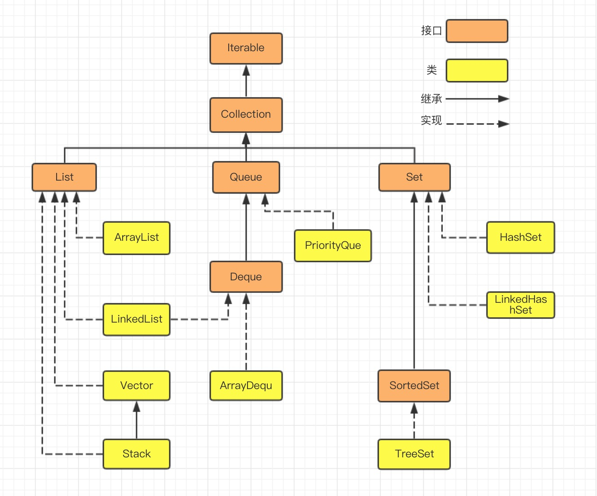
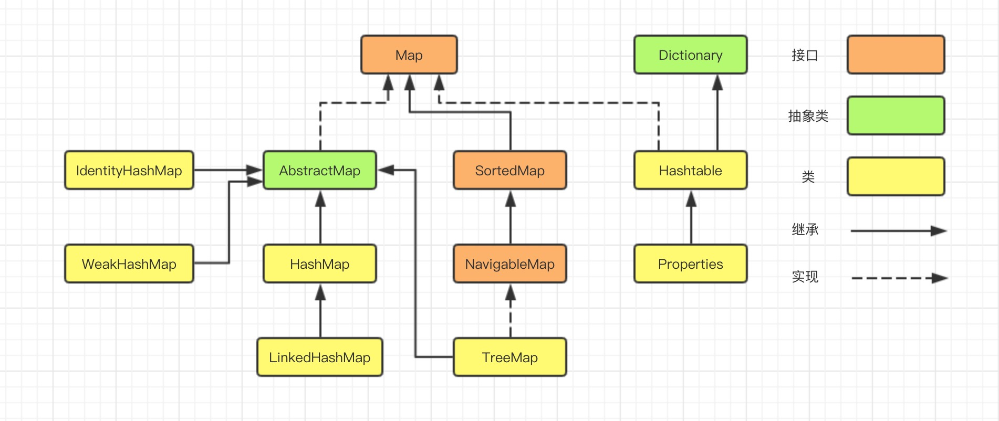
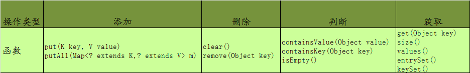
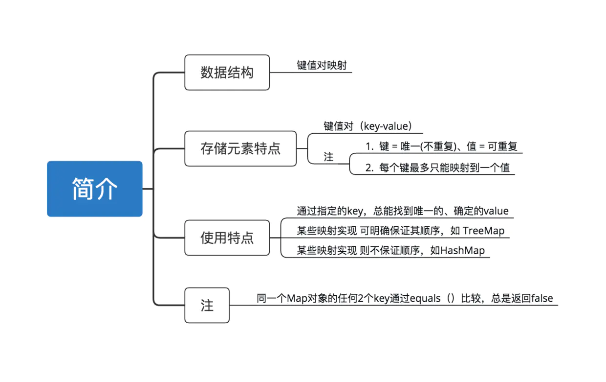
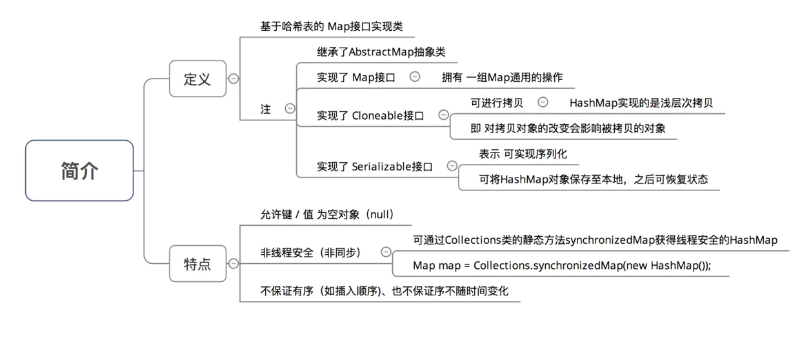
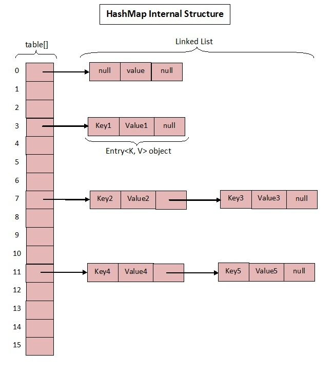
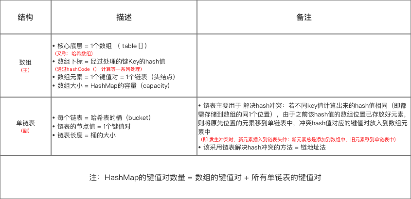
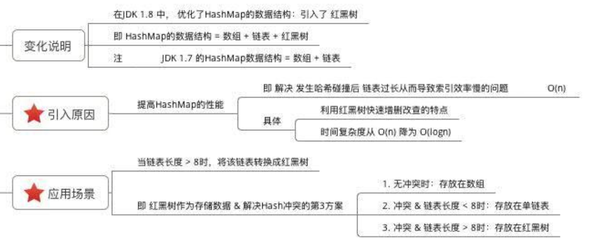

# Java面试炼金系列 (2)  | Map接口、HashMap类的常见面试题剖析

## 0x0 基础知识

### 1. 集合体系

Java集合是面试中的重要考点，特别是List和Map接口实现类，属于工作中CRUD最常用的工具，所以经常在面试中出现，用于考察面试者的Java基本功。

Java 集合大致可以分为两大体系，一个是 Collection，另一个是 Map；

- Collection ：主要由List、Set、Queue接口组成，List代表有序、重复的集合；其中Set代表无序、不可重复的集合；Java 5 又增加了Queue体系集合，代表一种队列集合实现。
- Map：则代表具有映射关系的键值对集合。

**java.util.Collection 下的接口和继承类关系简易结构图：**

**java.util.Map 下的接口和继承类关系简易结构图：**

关于集合框架的详细解释会在下节中阐述，本节只关注Map，以及重点内容HashMap。

### 2. Map接口

- Correction、Set、List接口都属于单值的操作，而Map中的每个元素都使用key——>value的形式存储在集合中。
- Map集合：该集合存储键值对。一对一对往里存。而且要保证键的唯一性。

### 3. HashMap实现类

HashMap内部实现细节是面试中最常见的高频考点，除了最基础的用法之外，对于不同版本的底层实现（JDK1.7 和JDK1.8）的细节和区别也需要掌握。

#### 3.1 简介

#### 3.2 底层数据结构：Hash表

**数组**：采用一段连续的存储单元来存储数据。对于指定下标的查找，时间复杂度为O(1)；通过给定值进行查找，需要遍历数组，逐一比对给定关键字和数组元素，时间复杂度为O(n)，当然，对于有序数组，则可采用二分查找，插值查找，斐波那契查找等方式，可将查找复杂度提高为O(logn)；对于一般的插入删除操作，涉及到数组元素的移动，其平均复杂度也为O(n)

**线性链表**：对于链表的新增，删除等操作（在找到指定操作位置后），仅需处理结点间的引用即可，时间复杂度为O(1)，而查找操作需要遍历链表逐一进行比对，复杂度为O(n)

**二叉树**：对一棵相对平衡的有序二叉树，对其进行插入，查找，删除等操作，平均复杂度均为O(logn)。

**哈希表**：相比上述几种数据结构，在哈希表中进行添加，删除，查找等操作，性能十分之高，不考虑哈希冲突的情况下（后面会探讨下哈希冲突的情况），仅需一次定位即可完成，时间复杂度为O(1)，接下来我们就来看看哈希表是如何实现达到惊艳的常数阶O(1)的。

我们知道，数据结构的物理存储结构只有两种：**顺序存储结构**和**链式存储结构**（像栈，队列，树，图等是从逻辑结构去抽象的，映射到内存中，也这两种物理组织形式），而在上面我们提到过，在数组中根据下标查找某个元素，一次定位就可以达到，哈希表利用了这种特性，**哈希表的主干就是数组**。

**比如我们要新增或查找某个元素，我们通过把当前元素的关键字 通过某个函数映射到数组中的某个位置，通过数组下标一次定位就可完成操作。**
　　
这个函数可以简单描述为：**存储位置 = f(关键字)** ，这个函数f一般称为哈希函数，这个函数的设计好坏会直接影响到哈希表的优劣。举个例子，比如我们要在哈希表中执行插入操作：

- **解决哈希冲突**：
  - **如果两个不同的元素，通过哈希函数得出的实际存储地址相同怎么办**？也就是说，当我们对某个元素进行哈希运算，得到一个存储地址，然后要进行插入的时候，发现已经被其他元素占用了，其实这就是所谓的**哈希冲突**，也叫**哈希碰撞**。前面我们提到过，哈希函数的设计至关重要，好的哈希函数会尽可能地保证 计算简单和散列地址分布均匀,但是，我们需要清楚的是，数组是一块连续的固定长度的内存空间，再好的哈希函数也不能保证得到的存储地址绝对不发生冲突。那么哈希冲突如何解决呢？哈希冲突的解决方案有多种:开放定址法（发生冲突，继续寻找下一块未被占用的存储地址），再散列函数法，链地址法，而HashMap即是采用了**链地址法**，也就是**数组+链表**的方式。

#### 3.3 HashMap JDK1.7 实现

`JDK1.7` 中``HashMap` 采用的数据结构 = **数组（主） + 单链表（副）**：（也叫做拉链法）

#### 3.4 HashMap JDK1.8 实现

在原有数据结构（数据+单链表）的基础上引入了红黑树：

## 0x1 高频面试题

## 1.

## 2.

## 3.

## 4.

## 5.

## 6.

## 7.

## 8.

---

> Reference

http://www.justdojava.com/2019/09/16/java-collection-1/

https://juejin.im/entry/6844903741229891597

https://blog.csdn.net/woshimaxiao1/article/details/83661464

https://crossoverjie.top/2018/07/23/java-senior/ConcurrentHashMap/

https://blog.csdn.net/qq_36520235/article/details/82417949

https://blog.csdn.net/carson_ho/article/details/79373134