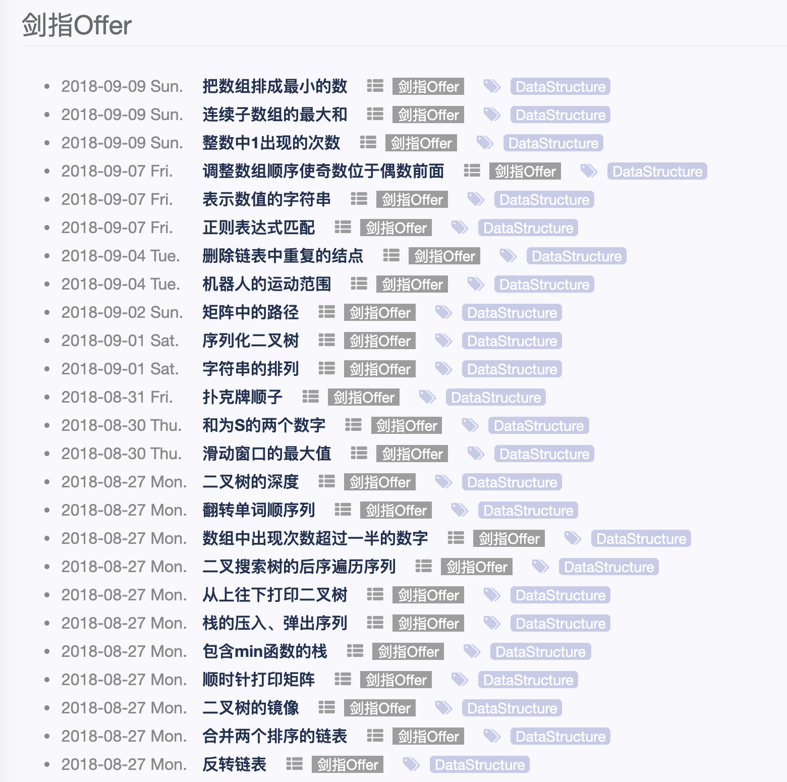
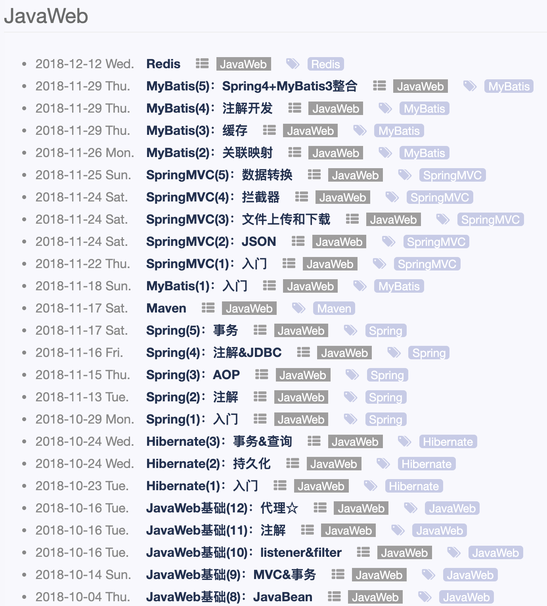

#### 0x0 问题

```
作为初学者的问题
1. 知识广度：需要学习哪些内容？
2. 知识深度：需要学到什么程度？企业招聘的门槛在哪里？
3. 快速入门：网上的资料很多很杂，但是如何快速上手JavaWeb？
```

#### 0x1 方法

##### 2018.8 

系统化学习`JavaWeb`的起因是从沙河校区搬到学院路之后的第一个暑假，想去体验企业实习，然后就投了百度的`Java`研发实习，发现自己没啥能够写在简历上的内容，跑到百度科技园面试，全程被面试官碾压，基本就是`你知道XXX吗? `，`这个没有了解过`，20多分钟就结束了第一次面试。这个阶段的我除了科班优势，没有能拿出手的亮点。

```
优势：
1. 北航计算机专业
劣势：
1. 在校成绩普通：GPA 50%，专业课一般
2. 没有项目经历
3. 没有企业实习经历
4. 没有参加ACM、蓝桥杯，没有论文
```

花了几天调研之后，主要制定了一些计划

```
1. 首先通过github.io page搭建个人博客，系统化笔记，方便复习和查看学习进度
2. 校招主要看重基础知识+项目+实习经历+比赛
	 2.1 基础知识是最容易提升的，主要分为编程能力[刷题提升] + Java[JVM + 多线程] + Web[基础+框架]
	 2.2 项目可以通过企业实习和网上视频资料打造
	 2.3 实习经历：这是比较难的，需要通过面试
	 2.4 比赛：性价比低，放弃，大三离秋招只有一年，没有多余的时间来参加
```

##### 2018.8 - 2018.9

8月主要是完成了70%的《剑指offer》，并且整理笔记如下[剑指offer](https://mio4.github.io/category/#剑指Offer)



##### 2018.9-2018.11

9月开始针对`JavaWeb`进行系统化学习，整理笔记如下[Web](https://mio4.github.io/category/#JavaWeb)



##### 2018.12

主要完成学校的编译课程，没啥进展

##### 2019.1


