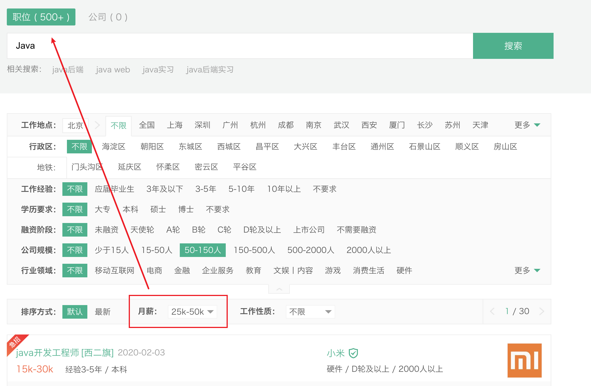
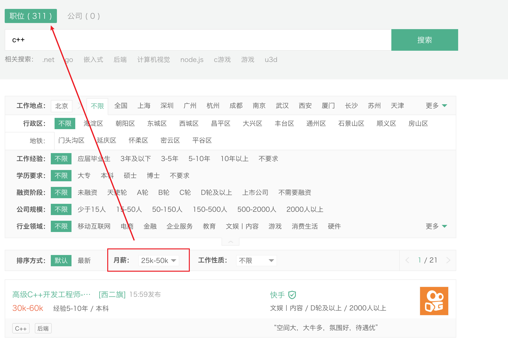
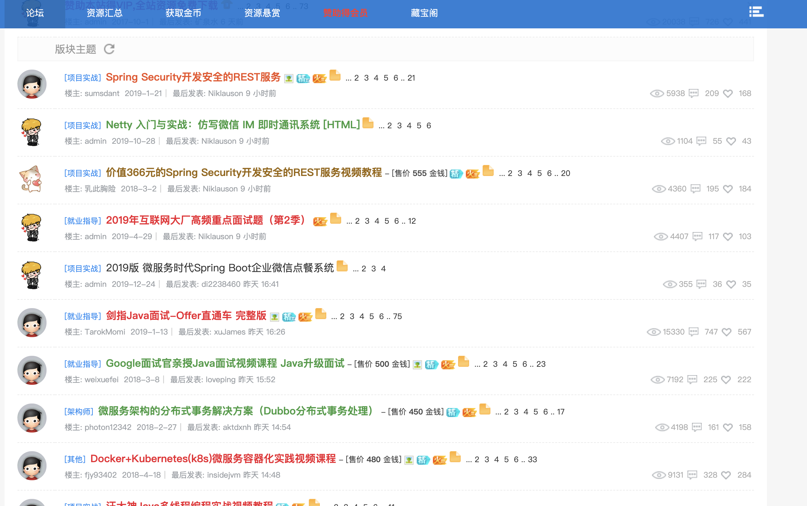
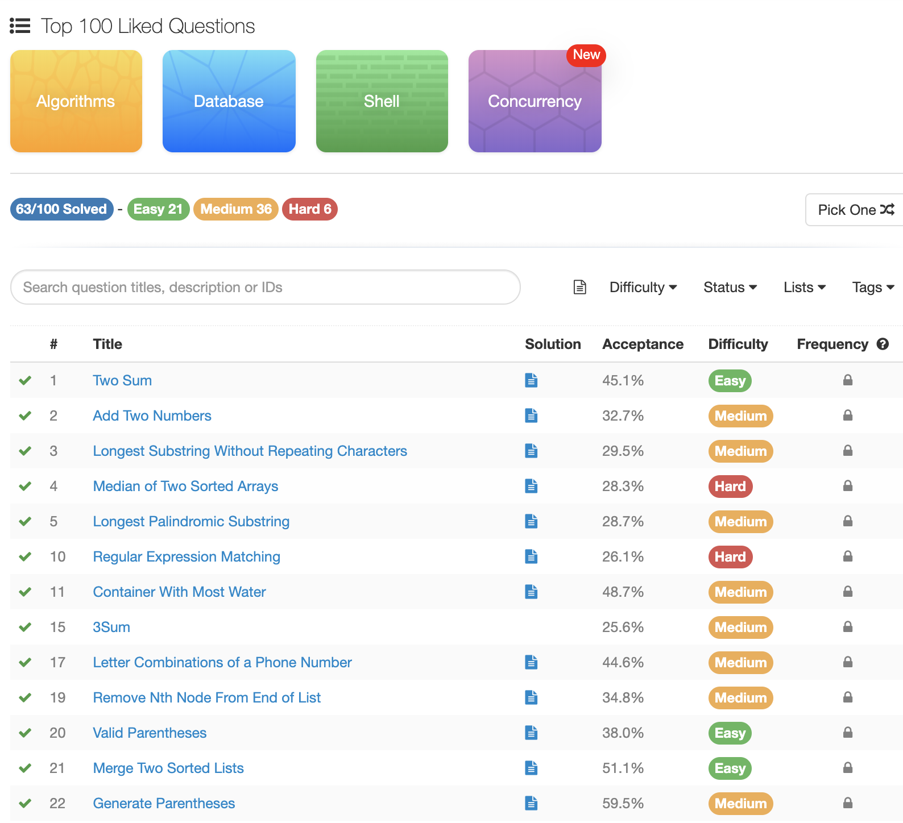

# 0x0 前期调研

> 以下经验根据个人的经验来谈，有一定的局限性，仅供参考。


## 1. 为什么不选择算法

计算机专业的就业方向很多，对于应届生来说，工种大概可以分为移动端、前端、后端、算法、运维、测试。

由于近年来ML和DL的快速发展，特别是16年AlphaGo以及视觉检测、自然语言处理方向的进展，人工智能方向成为了继大数据之后的又一个学术热点。

周围接触到的同学，大部分集中于算法和后端方向。我最开始就是准备深入后端方向，并且决定本科直接就业。但是我有两点纠结：

1. 后端是否**不如**算法？
2. 对于后端，本科学历是否适合职业发展预期？

```
1. 本科生以算法作为工作目标难度太高，和字节跳动的面试官交流，目前字节AI Lab的成员组成是大部分硕博，以及少部分优秀的本科生（acm区域金作为参考）
2. 算法需要的三点：实习、竞赛和paper，我都没有信心和诸多转专业的工科硕士抗衡
3. 个人对于算法没有强烈兴趣，发展空间不明朗，行业未来搭上5G的车，可能会有比较大的想象空间，风险和收益并存。
```

**参考**

[2021 校招算法岗， 劝退还是继续](https://zhuanlan.zhihu.com/p/87895563)

[如何看待 2020 届校招算法工程师岗位求职人数远大于招聘岗位的现象？](https://www.zhihu.com/question/342267611)


## 2. 为什么选择Java后端

如果认定了后端，后端语言这么多，如何选择适合自己的方向？

业界有一种说法：『语言只是工具，数据结构和算法是解决问题的根本』。这种说法本身是没有错的，但是从普遍来看，本科生从有工作的想法到秋招，只有（或者不到）一年的时间，泛泛了解多个方向不如深入特定方向，更有助于求职。

后端主要的开发语言有`Java`、`C++`、`Python`、`PHP`、`Go`，PHP目前除了百度和腾讯部分部门之外，使用范围不广，不予讨论。另外，`Golang`作为高并发场景的常见支持，在云计算领域使用比较广泛。

**互联网和其他资本市场没有本质区别，既然是市场，就存在供求关系。** 对于算法这种供远远大于求的情况，就是买方市场，卖方（求职者）需要更好的产品（技能）来获得同等的价格。对于应届生来说，找到一个良好的买方市场，更加有利。

调研基于两个预设条件：

1. 岗位数目越多，市场的需求越大。
2. 高薪岗位越多，该方向的发展前景越大。

我们参考`www.lagou.com`，互联网大部分猎头或者对外招聘岗位都会发布在上面，有一定的参考价值。

*地点选择北京，薪资范围选择25~50k/month。*


##### Java



（1）**职位500+，可以看出需求缺口很大**。

（2）除此之外，`Java`生态系统最为完善，e.g. `Spring`全家桶。

（3）**`Java`是电商网站的技术首选**，阿里、京东、拼多多等电商公司的技术栈。


##### Python


`Python`主要是作为脚本语言，适用于运维开发和算法岗位，目前在字节跳动使用比较广泛，可以看出岗位相对较少。适合作为辅助开发语言，毕竟写脚本算得上是程序员的必备技能了。


##### C++



`C++`是游戏开发（其次还有lua）和系统开发的首选语言，但是因为上手成本比较高（指针和内存管理）以及需要对操作系统深入了解，市场岗位需求也不如`Java`，所以不推荐。不过如果有acm或者信息竞赛基础，也不成问题。


# 0x1 秋招准备

随着互联网从业人数越来越多，竞争也呈现白热化。科班学生不仅要和同专业同学竞争，也会感受到转专业同学（大部分是硕士）带来的压力。参考同系讲师的数据，我航15年时6系本科同学比较容易就能去BAT，到了19年BAT头条对于大部分同学不是想进就进了。

从宏观意义上来看招聘，企业需要找到适配岗位的员工，学生需要谋取职业生涯的第一份工作。对于学生来说，秋招和高考在本质上是相似的，都是一种选拔，需要证明自己的能力比别人更强。

在准备的时候，定量的标准往往更加具有说服力，『我守望先锋玩的很厉害』远远不如『我守望先锋全国天梯4000分』，『我学习Java花了很多时间』不如『我阅读了《Java核心思想》和《Effective Java》以及...，并且复现了书中的代码，在github仓库xxx』。


我是从2018.8月下旬（进入大三）开始准备，到找到工作总共花了一年的时间，基本上分为三个时期：

1. *2018.8 - 2018.12* ：基本素质培养
2. *2019.1 - 2019.8* ：  百度智能云实习
3. *2019.7 - 2019.8* :    秋招提前批

整个秋招的核心思路 = **基础+实习+项目**

#### 1. 基本素质

第一次认清自己的水平，是在大二下学期结束的暑假。当时投了百度暑期实习，毫无准备的前提下，只用了20分钟就挂在了一面。

面试惨跪之后，我分析了自己的处境，当时的我在校绩点中等，没有参加程序竞赛，没有实习经验，除了OO课程，没有写过"大型"项目。从编程能力上看，大一数据结构60分酱油飘过，算法课程也限于理论，只能说能够应付考试不挂科，`Java`只会语法，甚至没有用过Spring。

**这时候的我深刻意识到自己在编程方面还是个在新手村找不到北的菜鸡，离刚来我航躺着进BAT的幻想越来越远。**

相对于隔壁北邮，我航更加注重学生的深造（校内读研和出国留学），对于工作方面的指导甚少。我大部分的时间都是一个人准备，所以经常陷入迷茫orz，这期间主要的问题是：

1. 选择什么方向？ （前面已经分析）
2. 要学习什么内容？
3. 要学到什么程度，才能找到实习/工作？

整个秋招的过程，就是我解决这三个问题的过程。


于是，首先我使用Hexo + Github.io 搭建了个人博客：[mio4](http://mio4.github.io/) 

博客有两个作用：

1. 能够体系化自己的学习，方便复习
2. 量化自己的学习成果，面试的时候，给面试官带来好印象

其次开始有**针对性**的训练自己的编程能力，

`Java`程序员的基本素质有：Java基础（语法+JVM+多线程），Spring框架（SSM/SpringBoot，进阶可以SpringCloud），算法能力（刷题）


#### 2. BAT实习

找实习，认准BAT TMD。其中BATT（头条）基本属于一个档；外企的话，ms/hulu/airbnb认可度也很高。

虽然近几年百度已经明显掉队于BAT，但是就我个人体验来看，外界对于百度的技术还是很认可的。对于实习来说，镀金的效果完全够用。

在2019.1月，托研二学长的福，内推经过三面通过了百度智能云计算部的后端实习，面经：https://www.nowcoder.com/discuss/151829

到8月结束了实习，半年的实习时光对于业界有了更深入的了解。

#### 3. 秋招面试

离开baidu主要有两个原因：

1. 工作内容不算满意：在baidu的工作语言主要是php，大厂目前使用php的很少，不利于职业长期发展；另外实习负责的模块也不算核心。
2. 薪资不够预期：baidu本科白菜价15k*15，每个月的工资扣掉五险一金和税，只剩下11k。

因为花了接近一年时间准备，所以在提前批就结束了秋招，9月大部分企业刚开通秋招正式批通道前，我就歇了。


一年前我对于秋招的预期是，能够找到一个税前20w的工作就算合格；最后的结果远远超过预期，基本都在35w以上。提前批收到了百度、字节跳动等大厂和独角兽的offer，互联网薪资保密，拿个拒掉的独角兽offer举例：


# 0x2 其他经验

#### 1. 书籍推荐

国内csdn以及各种类似菜鸟教程的博客的知识系统往往支离破碎，不能深入学习。

看书能够系统化学习知识，下面推荐**我看过**的一些书

- 算法：
  - 《剑指Offer》

- Java：
  - 《Java核心技术》，当字典看，不需要整遍过

  - **《Java并发编程实战》** ，熟悉多线程
  -  **《深入理解Java 虚拟机**》，熟悉JVM必备
  - **《图解Java多线程设计模式》**，日本人写的书，直观易懂，强力推荐
  - 《Java 8实战》
  - 《Effective Java》

- Spring：
  - 《Spring实战》

- MySQL：
  - 《高性能MySQL》，主要是第五六章
  - 《Redis实战》
- 网络：
  - 《图解HTTP》
  - 《计算机网络自顶向下方法》

- 代码规范：
  - 《重构》

#### 2. 准备项目

对于在校学生来说，准备项目可能会面临着无法下手的问题。

首先项目一般不是自己凭空想出来的，可以通过实验室等方式接手比较成熟的方案。

我的操作是直接使用网课，比如[慕课](https://www.imooc.com/)


选择一个感兴趣的，从0到1复现一个项目，完善自己的技术栈。

当然，imooc上大部分干货需要付费，学生党如果没钱可以考虑：

[蒲公英论坛](https://npupt.com/index.php)：ipv6不走校园网流量，有部分搬运的资源

[dmz社区](http://www.dmzshequ.com/)：**盗版资源论坛，基本上涵盖所有imooc的视频代码资料，仅供参考**。PS：需要会员账号可以找我。



#### 3. 算法能力

面试必备：《剑指offer》 + LeetCode 

LeetCode题目比较多，我一般选择Hot/Top 100 练习。



到秋招结束，刷题量不多，总共100左右，但是对每道题使用思维导图进行总结，尽可能举一反三：


#### 4. 实习投递

投递实习的方式一般有：

- [x] **熟人内推**：最靠谱最快的方式，投递简历到百度实习面试邀约只花了不到半天。

- [x] 牛客网：响应时间一般，1~7天
- [x] 实习僧app ：响应时间一般，一般一周
- [x] 官方通道：比如腾讯的暑期实习官方在线投递。


#### 4. 面试技巧 

分公司分岗位的面经可参考：www.nowcoder.com

我的个人面经总结：https://github.com/mio4/learn-java/blob/master/Note/interview.md ，总共250页的PDF，综合个人经历的所有面试，题目覆盖率至少有50%。根据研二转专业的同学反馈来看，作用很大。

**TODO 未完待续**


